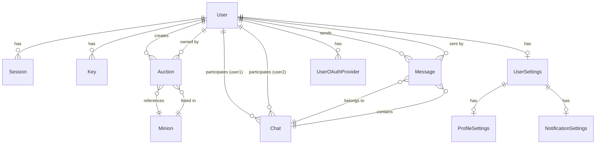

## Overview

MinionAH uses **PostgreSQL** as its database, managed through **Prisma ORM**. The schema is designed to handle user authentication, minion auction listings, real-time messaging, and user preferences.

## Database Provider

- **Database**: PostgreSQL
- **ORM**: Prisma Client
- **Schema Location**: `prisma/schema.prisma`

## Entity Relationship Diagram



## Core Entities

The database schema is organized into several functional groups:

<AccordionGroup>
  <Accordion title="Authentication & Users">
    - **User**: Core user accounts
    - **Session**: Active user sessions
    - **Key**: Password hashes and authentication keys
    - **UserOAuthProvider**: OAuth authentication providers
  </Accordion>

  <Accordion title="User Settings & Preferences">
    - **UserSettings**: Parent settings container
    - **ProfileSettings**: Public profile information
    - **NotificationSettings**: Notification preferences and FCM tokens
  </Accordion>

  <Accordion title="Marketplace">
    - **Minion**: Minion definitions and metadata
    - **Auction**: Active auction listings
  </Accordion>

  <Accordion title="Messaging">
    - **Chat**: Conversation threads between users
    - **Message**: Individual messages in chats
  </Accordion>
</AccordionGroup>

## Key Relationships

### User Relationships

The `User` model is the central entity with multiple one-to-many relationships:

- **Authentication**: One user has many sessions and keys
- **Marketplace**: One user creates many auctions
- **Messaging**: One user participates in many chats (as either user1 or user2)
- **Settings**: One user has one settings record
- **OAuth**: One user can have multiple OAuth providers

### Chat Relationships

Chats use a self-referential pattern with two user participants:

```prisma
chatsAsUser1 Chat[] @relation("user1")
chatsAsUser2 Chat[] @relation("user2")
```

This allows each chat to have exactly two participants with distinct roles.

### Cascade Deletions

Most relationships use `onDelete: Cascade` to maintain referential integrity:

- Deleting a user removes all their sessions, keys, auctions, messages, and settings
- Deleting a chat removes all messages in that chat
- Deleting a minion removes all auctions for that minion

<Note>
  **Data Safety**: Be cautious when deleting users or minions, as cascade deletions will remove all related data permanently.
</Note>

## Indexes

The schema includes strategic indexes for query optimization:

| Model | Indexed Fields | Purpose |
|-------|----------------|----------|
| **Auction** | `user_id`, `minion_id` | Fast lookup of user auctions and minion listings |
| **Message** | `chat_id`, `user_id` | Efficient message retrieval and user message history |
| **Session** | `userId` | Quick session validation |
| **Key** | `user_id` | Fast authentication lookups |
| **UserOAuthProvider** | `userId` | Efficient OAuth provider queries |

## Enums

### NotificationType

Defines available notification channels:

- `EMAIL`: Email notifications
- `DEVICE`: Push notifications to mobile devices
- `DISCORD`: Discord webhook notifications

### MessageType

Specifies the type of message content:

- `TEXT`: Standard text messages
- `AUCTION`: Messages containing auction references

## Generated Client

The Prisma client is generated to:

```
src/generated/prisma
```

With support for:
- Native binaries
- Linux ARM64 with OpenSSL 3.0.x

## Environment Variables

The database requires two connection URLs:

- `DATABASE_URL`: Standard connection for Prisma Client
- `DIRECT_DATABASE_URL`: Direct connection for migrations and schema operations

<Note>
  Both URLs should point to your PostgreSQL instance. The direct URL is used for operations that cannot use connection pooling.
</Note>