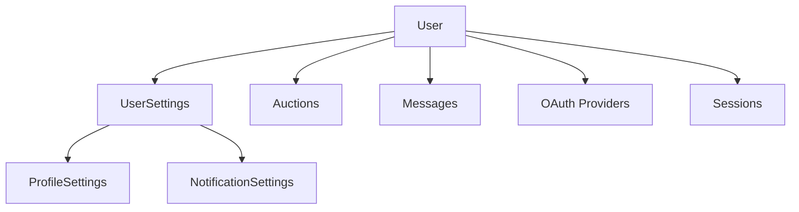

User settings allow you to customize your MinionAH experience by managing your profile information, notification preferences, and account integrations.

## Settings Overview

Your MinionAH account has three main settings categories:

<CardGroup cols={3}>
  <Card title="User Settings" icon="user">
    Core account configuration and linking
  </Card>
  <Card title="Profile Settings" icon="id-card">
    Public profile information and bio
  </Card>
  <Card title="Notification Settings" icon="bell">
    Alert preferences and delivery methods
  </Card>
</CardGroup>

## User Settings

Core account settings that control your identity and integrations.

### Account Structure

Your user account stores:

```typescript
model User {
  id           String              @id
  username     String              @unique
  createdAt    DateTime            @default(now())
  loggedInAt   DateTime            @default(now()) @updatedAt
  syncedAt     DateTime?
  
  // Relationships
  settings     UserSettings?
  oauth        UserOAuthProvider[]
  auctions     Auction[]
  sessions     Session[]
}
```

### Key Fields

<ParamField path="id" type="string" required>
  Your unique user identifier used across the platform
</ParamField>

<ParamField path="username" type="string" required>
  Your MinionAH username (must be unique across all users)
</ParamField>

<ParamField path="createdAt" type="DateTime">
  When your account was created
</ParamField>

<ParamField path="loggedInAt" type="DateTime">
  Last login timestamp (automatically updated)
</ParamField>

<ParamField path="syncedAt" type="DateTime" optional>
  Last time your account data was synchronized
</ParamField>

### Discord Integration

Link your Discord account to use bot commands and receive notifications.

<Steps>
  <Step title="Initiate Linking">
    Use the `/discord link` command in Discord:
    ```
    /discord link
    ```
  </Step>
  
  <Step title="Visit Settings Page">
    Click the "Link Discord Account" button in the bot's response to open your account settings at `https://minionah.com/profile/settings`.
  </Step>
  
  <Step title="Complete Connection">
    Follow the on-screen instructions to authorize the connection between your Discord and MinionAH accounts.
  </Step>
  
  <Step title="Verify Link">
    Your Discord username will appear in your MinionAH profile once linked successfully.
  </Step>
</Steps>

<Note>
A linked Discord account is required to create auctions, receive notifications, and access personalized bot features.
</Note>

### OAuth Providers

Manage external authentication providers connected to your account.

```typescript
model UserOAuthProvider {
  id               String    @id @unique
  userId           String
  provider         String    // e.g., "discord", "google"
  providerUsername String
  syncedAt         DateTime? @default(now())
}
```

Each OAuth connection tracks:
- **Provider name**: Which service (Discord, etc.)
- **Provider username**: Your username on that service
- **Sync status**: When the connection was last verified

### Unlinking Discord

To unlink your Discord account:

```
/discord unlink
```

<Warning>
Unlinking your Discord account will:
- Disable auction creation via Discord
- Stop Discord notifications
- Remove access to Discord-only bot commands

You can always relink later using `/discord link`.
</Warning>

## Profile Settings

Customize your public profile visible to other MinionAH users.

### Profile Structure

```typescript
model ProfileSettings {
  id           String       @id
  email        String?
  bio          String?
  urls         String[]     // Social links, websites, etc.
}
```

### Configurable Fields

<ParamField path="email" type="string" optional>
  Your contact email (can be hidden from public profile)
</ParamField>

<ParamField path="bio" type="string" optional>
  A short biography or description about yourself (visible to other users)
</ParamField>

<ParamField path="urls" type="string[]" optional>
  List of URLs to your social media profiles, websites, or other links
</ParamField>

### Editing Your Profile

<Tabs>
  <Tab title="Via Website">
    1. Log in to MinionAH.com
    2. Navigate to **Profile → Settings**
    3. Click on the **Profile** tab
    4. Edit your bio, email, and URLs
    5. Save changes
  </Tab>
  
  <Tab title="Via Discord Button">
    1. Use any bot command that shows settings
    2. Click **Go to Account Settings** button
    3. Navigate to the Profile section
    4. Make your changes and save
  </Tab>
</Tabs>

### Profile Visibility

Your profile is visible to:
- Users viewing your auction listings
- Users you're chatting with
- Anyone who visits your profile page at `https://minionah.com/user/{username}`

<Accordion title="What Others See">
  When users view your profile, they can see:
  - Your username
  - Your bio (if set)
  - Your social links (if added)
  - Your active auctions
  - Your join date
  
  They cannot see:
  - Your email (unless you explicitly share it)
  - Your notification settings
  - Your login history
  - Your private messages with other users
</Accordion>

## Notification Settings

Control how and when you receive notifications.

### Notification Structure

```typescript
model NotificationSettings {
  id                  String             @id
  notificationType    NotificationType[] // [EMAIL, DEVICE, DISCORD]
  marketNotifications Boolean            @default(true)
  socialNotifications Boolean            @default(true)
  fcmTokens           String[]           // Firebase Cloud Messaging tokens
}
```

### Notification Delivery Methods

<Tabs>
  <Tab title="Discord">
    Receive notifications as Discord DMs from the MinionAH bot.
    
    **Requirements:**
    - Linked Discord account
    - DMs enabled from server members
    - Bot not blocked
    
    **Best for:** Real-time alerts while using Discord
  </Tab>
  
  <Tab title="Email">
    Receive notifications via email to your registered address.
    
    **Requirements:**
    - Valid email in profile settings
    - Email verified
    
    **Best for:** Backup notifications and email record keeping
  </Tab>
  
  <Tab title="Device">
    Receive push notifications on your mobile device.
    
    **Requirements:**
    - MinionAH mobile app installed
    - Push notifications enabled
    - FCM token registered
    
    **Best for:** Mobile alerts on the go
  </Tab>
</Tabs>

### Notification Categories

<ParamField path="marketNotifications" type="boolean" default="true">
  Alerts about your auctions:
  - Auctions expiring soon
  - Successful sales
  - Price updates
  - Auction status changes
</ParamField>

<ParamField path="socialNotifications" type="boolean" default="true">
  Alerts about user interactions:
  - New messages
  - Chat replies
  - Trade requests
  - User mentions
</ParamField>

### Managing Notification Preferences

<Steps>
  <Step title="Access Notification Settings">
    Visit `https://minionah.com/profile/settings/notifications` or click "Manage Notifications" in any notification message.
  </Step>
  
  <Step title="Select Delivery Methods">
    Check or uncheck: Discord, Email, Device based on your preferences.
  </Step>
  
  <Step title="Configure Categories">
    Toggle Market Notifications and Social Notifications on or off.
  </Step>
  
  <Step title="Save Preferences">
    Changes are applied immediately—no restart or re-login required.
  </Step>
</Steps>

<Accordion title="Recommended Settings">
  **For Active Traders:**
  - ✅ Discord notifications
  - ✅ Email notifications (backup)
  - ✅ Market notifications
  - ✅ Social notifications
  
  **For Casual Users:**
  - ✅ Discord notifications
  - ❌ Email notifications
  - ✅ Market notifications
  - ⚠️ Social notifications (optional)
  
  **For Minimal Alerts:**
  - ✅ Discord notifications only
  - ✅ Market notifications
  - ❌ Social notifications
</Accordion>

## Account Security

### Authentication

Your account uses secure authentication:

```typescript
model Session {
  id        String   @id
  userId    String
  expiresAt DateTime
}

model Key {
  id              String  @id
  hashed_password String?
  user_id         String
}
```

- **Sessions**: Temporary authentication tokens that expire
- **Keys**: Secure password hashes (never stored in plain text)

### Security Best Practices

<CardGroup cols={2}>
  <Card title="Strong Passwords" icon="lock">
    Use a unique, complex password for your MinionAH account.
  </Card>
  
  <Card title="Regular Logouts" icon="right-from-bracket">
    Log out from shared or public devices after use.
  </Card>
  
  <Card title="Monitor Sessions" icon="eye">
    Check your active sessions periodically and revoke unknown ones.
  </Card>
  
  <Card title="Verify OAuth" icon="shield-check">
    Only authorize trusted OAuth providers like Discord.
  </Card>
</CardGroup>

## Data Relationships

Your settings connect to other parts of the platform:

### Connected Data



- **Auctions**: All listings you create are linked to your user account
- **Messages**: Chats and conversations are tied to your profile
- **OAuth Providers**: External account connections (Discord, etc.)
- **Sessions**: Active login sessions across devices

### Data Privacy

Your settings data is:
- ✅ Encrypted in transit (HTTPS)
- ✅ Stored securely in the database
- ✅ Not shared with third parties
- ✅ Deletable upon account closure

<Warning>
Deleting your account will permanently remove all your data, including auctions, messages, and settings. This action cannot be undone.
</Warning>

## Accessing Settings

### Via Discord Bot

Many bot commands include direct links to settings:

- `/discord link` - Links to account settings page
- Notification messages include "Manage Notifications" button
- Error messages may include "Go to Account Settings" button

### Via Website

Navigate directly to settings pages:

- **Main Settings**: `https://minionah.com/profile/settings`
- **Notifications**: `https://minionah.com/profile/settings/notifications`
- **Profile**: `https://minionah.com/profile/settings` (Profile tab)

### Settings Page Features

The settings interface provides:
- Real-time save (changes applied immediately)
- Visual feedback for saved changes
- Validation for required fields
- Help text for each setting

## Troubleshooting Settings

<AccordionGroup>
  <Accordion title="Can't Link Discord Account">
    **Solutions:**
    - Ensure you're logged into the correct MinionAH account
    - Verify you're using the `/discord link` command
    - Check that you haven't already linked a different Discord account
    - Try unlinking first with `/discord unlink`, then relink
  </Accordion>
  
  <Accordion title="Notifications Not Working">
    **Check:**
    - Notification settings have at least one delivery method enabled
    - Discord DMs are open (for Discord notifications)
    - Email is verified (for email notifications)
    - FCM token is registered (for device notifications)
    
    See [Notifications](/features/notifications) for detailed troubleshooting.
  </Accordion>
  
  <Accordion title="Profile Changes Not Saving">
    **Causes:**
    - Network connectivity issues
    - Invalid data format (e.g., malformed URLs)
    - Session expired (try logging out and back in)
    - Browser cache issues (try clearing cache)
  </Accordion>
  
  <Accordion title="Lost Access to Account">
    **Recovery Options:**
    - Use password reset on MinionAH.com
    - Contact support with account verification details
    - If Discord is linked, verify identity through Discord
  </Accordion>
</AccordionGroup>

## Advanced Settings

### Database Sync

The `syncedAt` field tracks when your account data was last synchronized across systems. This is updated automatically when:

- You link or unlink OAuth providers
- Your Discord account information changes
- Profile updates are propagated to external services

### Session Management

View and manage active sessions:
- See where you're logged in
- Check session expiry times
- Revoke specific sessions
- Force logout from all devices

## Related Features

- [Discord Commands](/commands/discord): Link your Discord account
- [Notifications](/features/notifications): Configure alert preferences
- [Auction Management](/features/auctions): Create and manage listings
- [Price Checking](/features/price-checking): View minion craft costs